# ⚽ Sadio Mané — Biography Website

<p align="center">
  <strong>Site web éducatif consacré au parcours et à la carrière de Sadio Mané</strong>
</p>

<p align="center">
  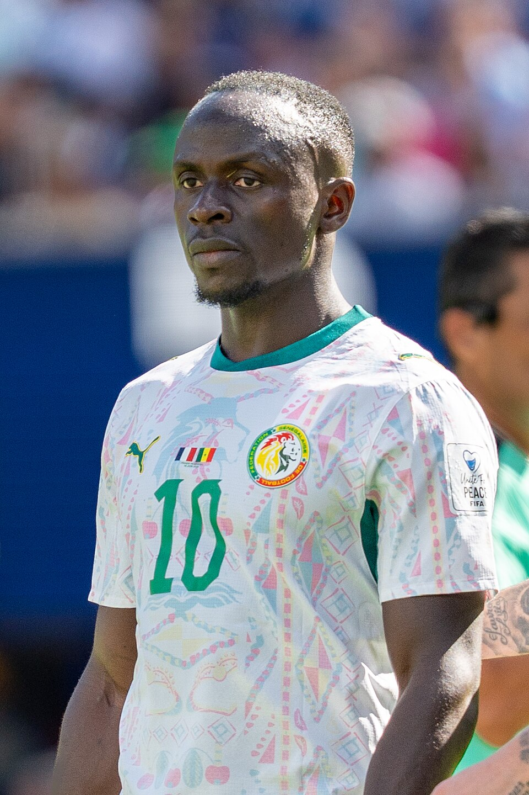
</p>

<p align="center">
  <a href="#-à-propos-du-projet">À propos</a> •
  <a href="#-fonctionnalités">Fonctionnalités</a> •
  <a href="#-technologies">Technologies</a> •
  <a href="#-aperçu-visuel">Aperçu</a> •
  <a href="#-installation-et-utilisation">Installation</a>
</p>

---

## 📌 À propos du projet

**Sadio Mané — Biography Website** est un projet web éducatif réalisé en **HTML, CSS et JavaScript**.

Le projet a pour objectif de présenter de manière structurée et visuelle le parcours de **Sadio Mané**, footballeur international sénégalais : sa présentation, sa biographie, les différentes étapes de sa carrière, son palmarès, quelques statistiques ainsi qu'une sélection de vidéos et de photographies.

Ce projet a également été reconstruit et amélioré à partir d'un ancien travail personnel afin de consolider les fondamentaux du développement web front-end et de disposer d'un projet propre à présenter dans un portfolio.

> **Type :** Projet éducatif / Portfolio  
> **Domaine :** Développement web front-end  
> **Niveau :** Projet d'apprentissage et de consolidation  
> **Stack :** HTML5 • CSS3 • JavaScript

---

## 🎯 Objectifs

Ce projet a principalement permis de travailler les compétences suivantes :

- structurer une page avec **HTML5 sémantique** ;
- organiser une interface avec **CSS3** ;
- créer une mise en page **responsive** ;
- utiliser les sélecteurs, classes et identifiants CSS ;
- mettre en place une navigation interne par ancres ;
- manipuler le **DOM avec JavaScript** ;
- gérer les événements utilisateur ;
- créer un menu mobile interactif ;
- détecter la section actuellement visible ;
- créer une galerie d'images interactive ;
- utiliser la navigation au clavier ;
- créer un bouton de retour en haut ;
- organiser et nettoyer un fichier JavaScript ;
- tester progressivement chaque fonctionnalité avant validation.

---

## ✨ Fonctionnalités

### 🧭 Navigation

- Navigation interne entre les différentes sections.
- Barre de navigation persistante lors du défilement.
- Mise en évidence de la section actuellement consultée.
- Menu responsive adapté aux petits écrans.
- Fermeture automatique du menu mobile après sélection d'une section.

### 📖 Contenu

Le site présente plusieurs sections :

- Accueil
- Présentation
- Biographie
- Carrière
- Palmarès
- Statistiques
- Vidéos
- Galerie
- Footer

### 🖼️ Galerie interactive

La galerie permet :

- d'agrandir une image ;
- d'afficher sa légende ;
- de passer à l'image suivante ;
- de revenir à l'image précédente ;
- de fermer la visionneuse ;
- de naviguer avec les touches `←` et `→` ;
- de fermer avec la touche `Échap`.

### ⬆️ Retour en haut

Un bouton apparaît après un certain niveau de défilement et permet de revenir progressivement en haut de la page.

---

## 🛠️ Technologies

| Technologie | Utilisation |
|---|---|
| **HTML5** | Structure et contenu de la page |
| **CSS3** | Mise en forme, responsive design et animations simples |
| **JavaScript** | Interactions et comportements dynamiques |
| **YouTube Embed** | Intégration des vidéos |

Aucun framework JavaScript ou CSS n'est utilisé.

Le projet repose volontairement sur les **technologies web fondamentales** afin de privilégier la compréhension de la structure, du style et du comportement d'une page web.

---

## 🏗️ Structure du projet

```text
sadio-mane-biography-01/
│
├── index.html
│
├── css/
│   └── style.css
│
├── js/
│   └── script.js
│
├── images/
│   ├── hero/
│   ├── career/
│   └── gallery/
│
└── README.md
```

### 📄 `index.html`

Contient la structure et le contenu du site :

- navigation ;
- sections principales ;
- textes ;
- images ;
- vidéos ;
- footer.

### 🎨 `css/style.css`

Contient :

- les styles généraux ;
- la navigation ;
- le hero ;
- les différentes sections ;
- la galerie ;
- la lightbox ;
- le responsive design ;
- le menu mobile ;
- le bouton retour en haut.

### ⚙️ `js/script.js`

Contient les fonctionnalités interactives :

- menu mobile ;
- fermeture du menu ;
- navigation active ;
- galerie / lightbox ;
- navigation clavier ;
- bouton retour en haut.

---

# 📸 Aperçu visuel

Cette section est volontairement prévue pour accueillir les **captures d'écran du projet**.

Les captures permettent de rendre le README plus professionnel et donnent immédiatement au visiteur une idée du résultat sans avoir besoin d'ouvrir le projet.

## 🏠 Page d'accueil

<!--
Ajoute ici une capture de la partie Hero / Accueil.

Exemple :
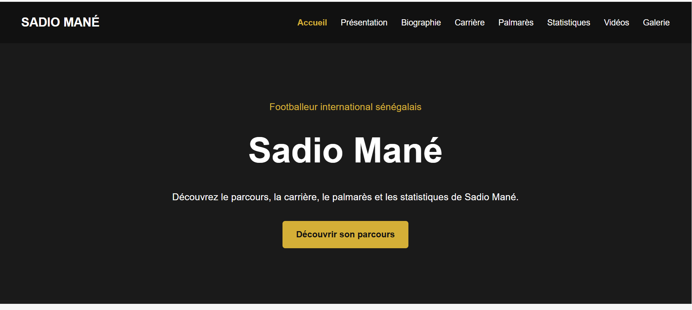
-->


---

## 👤 Présentation

<!--
Capture de la section Présentation :
photo + informations principales.
-->

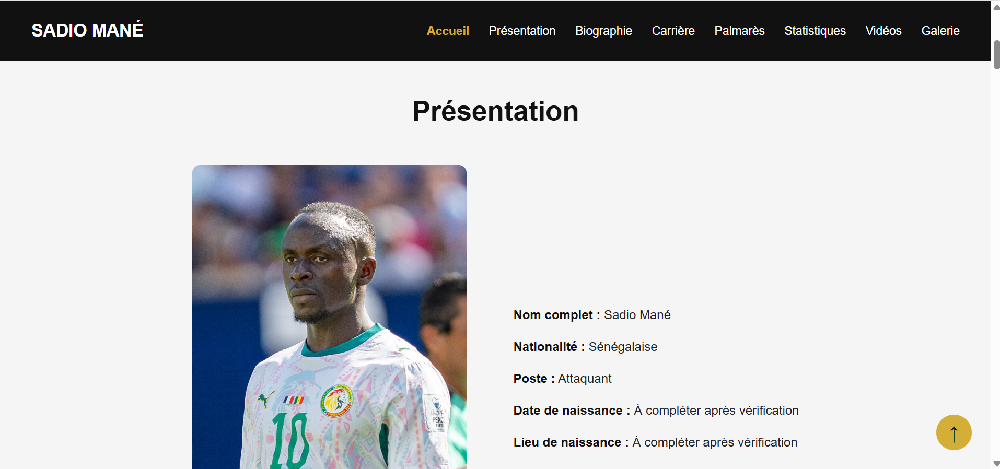

---

## 📖 Biographie

<!--
Capture montrant la section Biographie.
-->

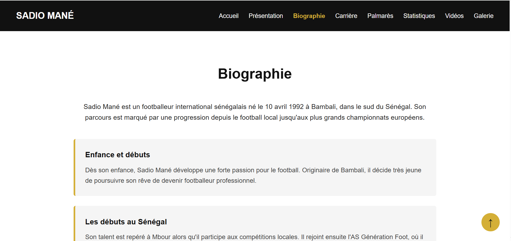

---

## 🏆 Carrière et palmarès

<!--
Capture montrant la timeline de carrière et/ou le palmarès.
-->

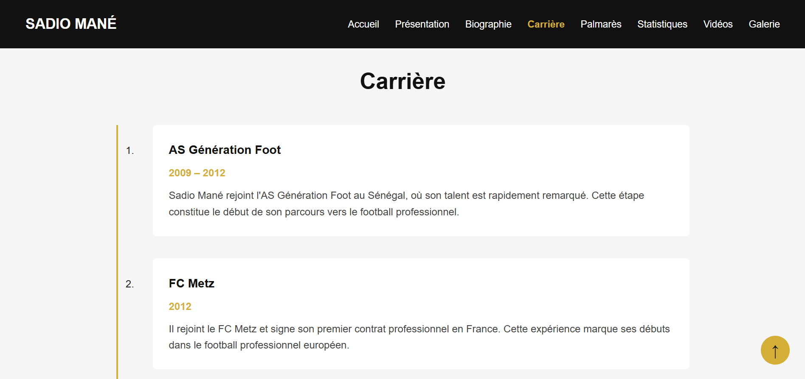

---

## 📊 Statistiques

<!--
Capture de la section Statistiques.
-->

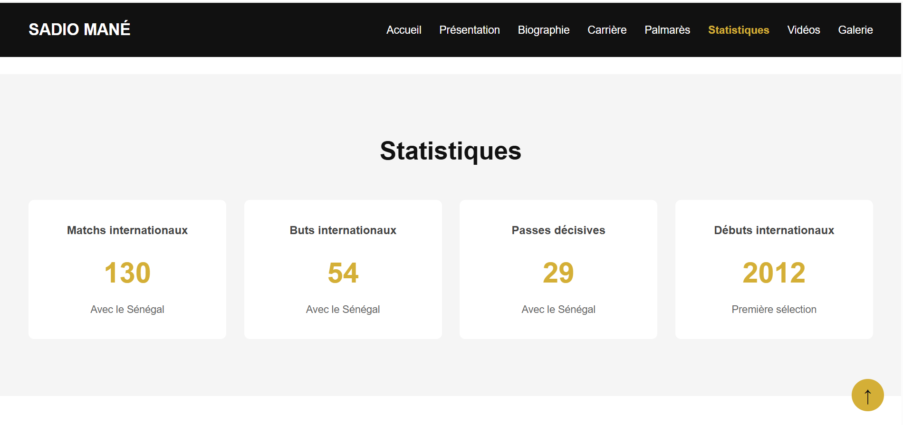

---

## 🎬 Vidéos

<!--
Capture de la section Vidéos.
-->

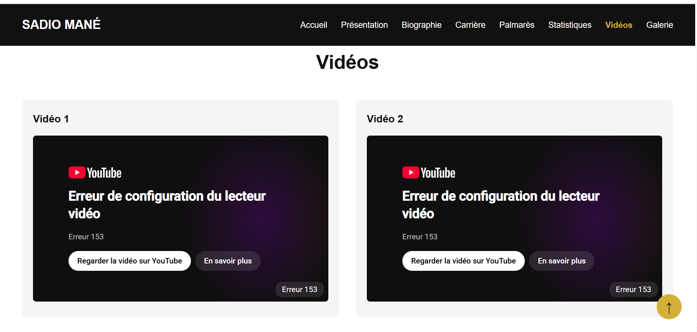

---

## 🖼️ Galerie interactive

<!--
Capture de la galerie avant ouverture de la lightbox.
-->

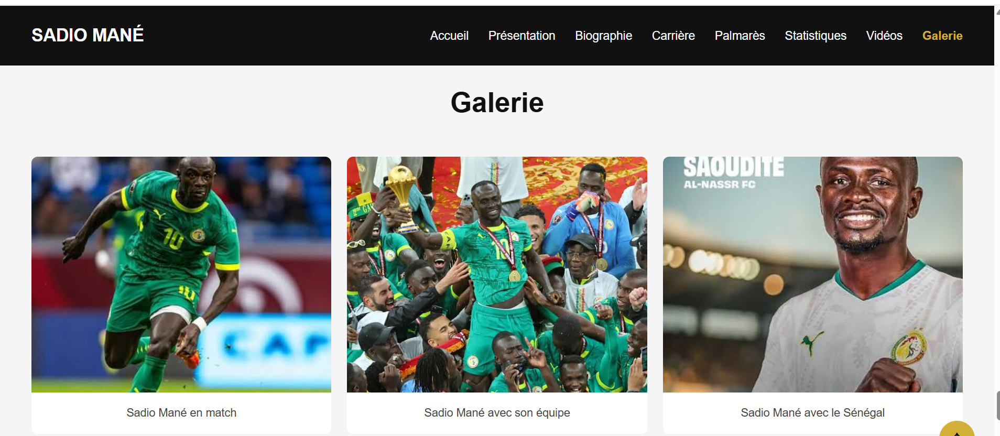

### 🔍 Lightbox

<!--
Capture de la lightbox avec une image agrandie.
-->

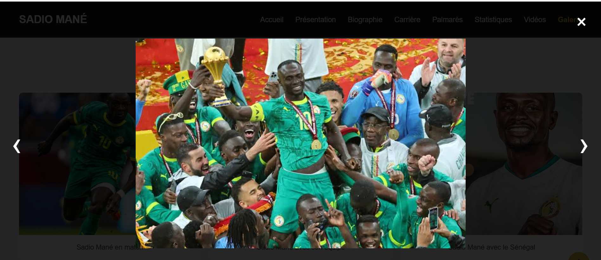

---

## 📱 Responsive design

Le site a également été conçu pour s'adapter aux différentes tailles d'écran.

### 💻 Desktop

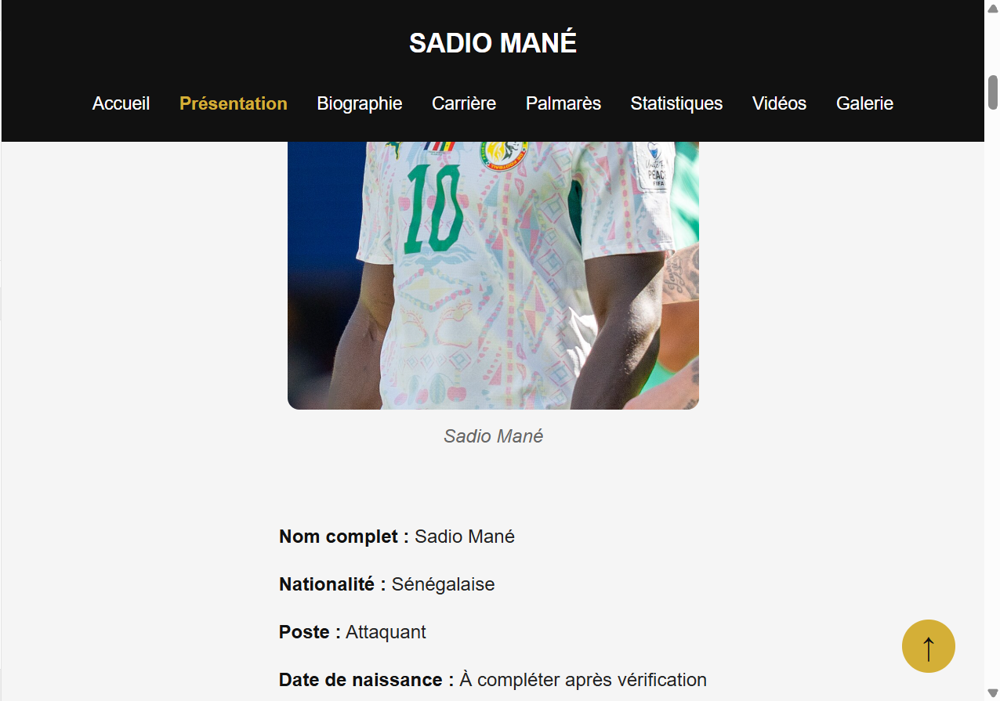

### 📱 Mobile

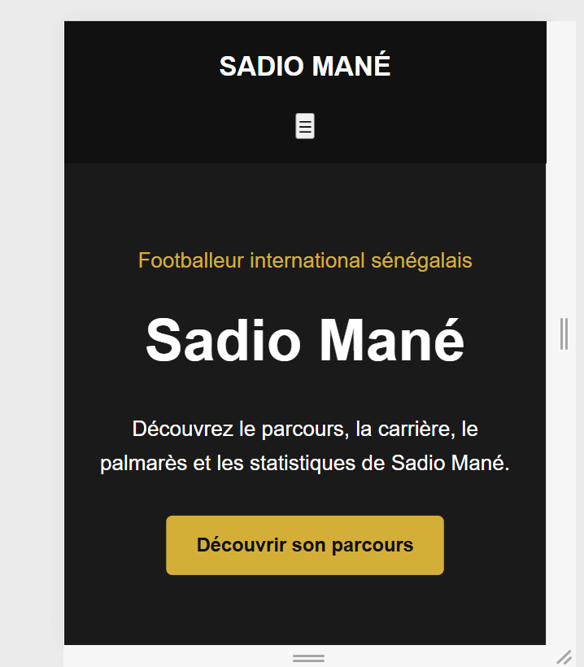

---

# 🧪 Tests et validation

Le projet a été développé progressivement avec une validation de chaque fonctionnalité avant de passer à la suivante.

### Tests réalisés

- [x] Chargement du HTML
- [x] Chargement du CSS
- [x] Connexion du JavaScript
- [x] Navigation entre les sections
- [x] Menu mobile
- [x] Fermeture du menu mobile
- [x] Barre de navigation persistante
- [x] Navigation active
- [x] Galerie interactive
- [x] Navigation précédente / suivante
- [x] Navigation au clavier
- [x] Fermeture avec `Échap`
- [x] Fermeture de la lightbox
- [x] Bouton retour en haut
- [x] Responsive desktop / tablette / mobile
- [x] Vérification de la console après les fonctionnalités JavaScript

---

# 🚀 Installation et utilisation

## 1. Cloner le dépôt

```bash
git clone https://github.com/AliouServiteurs/sadio-mane-biography-01.git
```

Remplacez `AliouServiteurs` par votre nom d'utilisateur GitHub.

## 2. Accéder au projet

```bash
cd sadio-mane-biography-01
```

## 3. Lancer le projet

Aucune installation de dépendances n'est nécessaire.

Le projet peut être ouvert directement avec :

```text
index.html
```

Pour une meilleure expérience de développement, il est recommandé d'utiliser un serveur local tel que **Live Server** dans Visual Studio Code.

---

# 📂 Organisation des captures

Pour conserver un dépôt propre, les captures peuvent être placées dans un dossier dédié :

```text
sadio-mane-biography-01-01/
│
├── screenshots/
│   ├── 01-accueil.png
│   ├── 02-presentation.png
│   ├── 03-biographie.png
│   ├── 04-carriere-palmares.png
│   ├── 05-statistiques.png
│   ├── 06-videos.png
│   ├── 07-galerie.png
│   ├── 08-lightbox.png
│   ├── 09-responsive-desktop.png
│   └── 10-responsive-mobile.png
│
└── README.md
```

---

# 🧠 Compétences mises en pratique

Ce projet m'a permis de consolider plusieurs fondamentaux du développement web :

### HTML

- structure HTML5 ;
- balises sémantiques ;
- hiérarchie des titres ;
- liens internes ;
- images et attributs `alt` ;
- listes ;
- `figure` / `figcaption` ;
- intégration de contenus externes.

### CSS

- sélecteurs ;
- classes et identifiants ;
- Flexbox ;
- CSS Grid ;
- positionnement ;
- pseudo-classes ;
- responsive design ;
- media queries ;
- `position: sticky` ;
- gestion d'une interface mobile.

### JavaScript

- variables avec `const` et `let` ;
- sélection d'éléments du DOM ;
- événements ;
- `addEventListener()` ;
- `classList`;
- `forEach()` ;
- conditions `if`;
- fonctions ;
- `IntersectionObserver` ;
- manipulation dynamique du DOM ;
- gestion du clavier.

---

# 🔐 Remarque sur les données

Les informations présentées sur le site doivent être vérifiées avant toute publication définitive.

Pour un projet de portfolio, il est préférable de conserver des informations :

- correctement sourcées ;
- datées lorsque les statistiques sont susceptibles d'évoluer ;
- cohérentes entre les différentes sections.

Les contenus multimédias intégrés doivent également respecter les conditions d'utilisation et les droits applicables.

---

# 📌 Améliorations possibles

Le projet peut évoluer progressivement avec de nouvelles fonctionnalités, par exemple :

- amélioration de l'accessibilité ;
- optimisation des images ;
- métadonnées SEO ;
- favicon ;
- partage social ;
- amélioration des performances ;
- publication avec GitHub Pages ;
- ajout d'une page dédiée aux sources.

Ces améliorations restent optionnelles et ne sont pas nécessaires au fonctionnement actuel du projet.

---

# 👨‍💻 Auteur

**Aliou DIOP**

Étudiant en Réseaux & Systèmes — Intérêt particulier pour le développement web, les réseaux et la cybersécurité.

---

# 📜 Licence

Projet réalisé dans un objectif **éducatif et de portfolio**.

Les contenus, photographies, vidéos et autres ressources appartenant à leurs auteurs ou ayants droit respectifs restent soumis à leurs conditions d'utilisation.

---

<p align="center">
  <strong>Projet éducatif — Sadio Mané Biography</strong>
</p>
